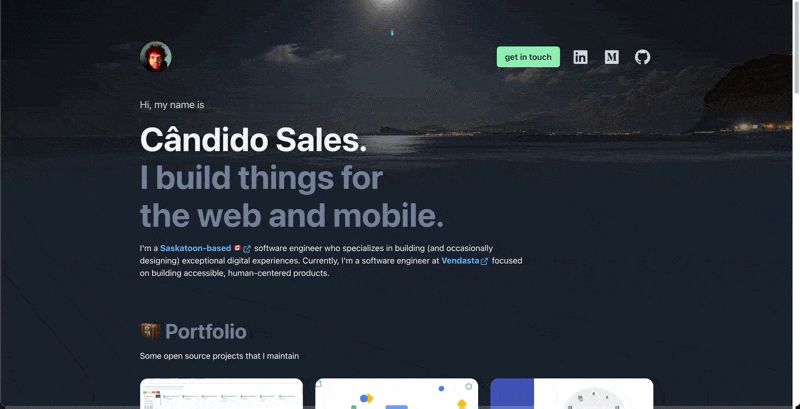

# Personal Portfolio

Landing page for your personal portfolio made with [NextJS](https://nextjs.org/) and [Chakra UI](https://chakra-ui.com/)

## Preview



- [Candido Sales Gomes Portfolio](https://www.candidosales.me/)

## 🎯 Features

- Dark mode;
- Integrate with Google Analytics;
- [Lazy loading images](https://web.dev/browser-level-image-lazy-loading/);
- [next/image](https://nextjs.org/docs/basic-features/image-optimization)
- [PWA](https://web.dev/progressive-web-apps/);

## ⚙️ How to setup

```bash
npm install
npm run dev
```

## 📚 Reference

- Dev Icons: https://github.com/devicons/devicon
- React Icons: https://react-icons.github.io/react-icons/icons?name=ri
- https://twitter.com/gontijodesign/status/1394624373823348737
- https://dev.to/swyx/how-to-add-prettier-and-eslint-automation-to-a-react-codebase-2gk1
- https://dev.to/actitime/how-to-build-a-great-developer-portfolio-examples-tools-bkj

## 👍 Contribute

If you want to say thank you and/or support the active development this project:

1. Add a [GitHub Star](https://github.com/candidosales/personal-blog/stargazers) to the project.
2. Tweet about the project [on your Twitter](https://twitter.com/intent/tweet?url=https%3A%2F%2Fgithub.com%2Fcandidosales%2Fpersonal-blog&text=Dependencies%20report%20aims%20to%20help%20analyze%20the%20consistency%20of%20the%20dependencies%20in%20your%20company%27s%20frontend%20projects).
3. Write a review or tutorial on [Medium](https://medium.com/), [Dev.to](https://dev.to/) or personal blog.
4. Support the project by donating a [cup of coffee](https://buymeacoff.ee/candidosales).

## ☕ Supporters

If you want to support Personal Portfolio, you can ☕ [**buy a coffee here**](https://buymeacoff.ee/candidosales)

## ✨ Acknowledgment

## Author

- Cândido Sales - [@candidosales](https://twitter.com/candidosales)

## ⚠️ Copyright and license

Code and documentation copyright 2020-2030 the [Authors](https://github.com/candidosales/personal-blog/graphs/contributors) and Code released under the [MIT License](https://github.com/candidosales/personal-blog/blob/master/LICENSE). Docs released under [Creative Commons](https://creativecommons.org/licenses/by/3.0/).
